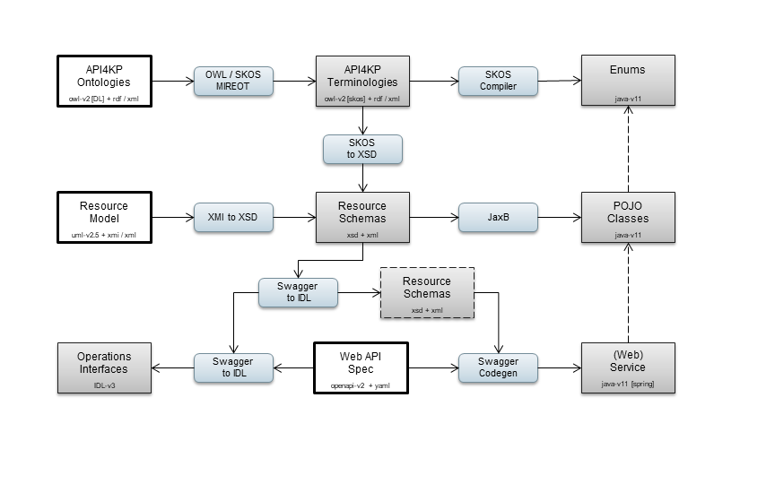
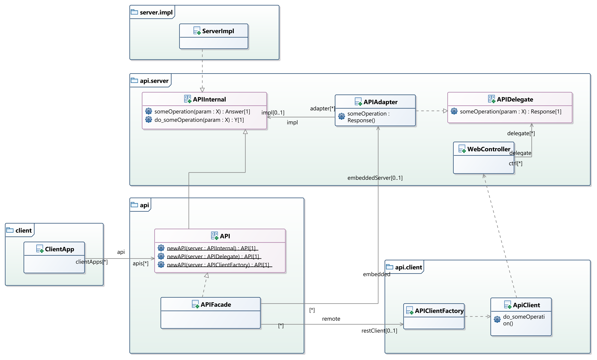
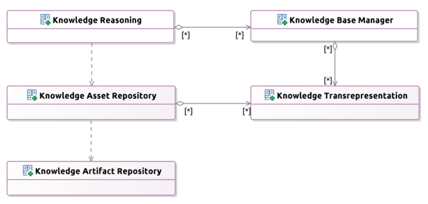

# PIM to PSM Architectural principles

The Java+Spring PSM is generated programmatically from the source, normative PIM models,
using a toolchain:

The toolchain combines:
- OWL Ontologies
  - Define the key API4KP terms and concepts
- Describe the platform capabilities
  - Drive the controlled vocabularies used to exchange information
- UML (Class) models
  - Define the information models / resource types used by the APIs
  - Include ontology-driven controlled vocabularies
- OpenAPI Specs
  - Define the services and API signatures
  - Leverage the UML-driven datatypes

### Client / Server Interfaces

In the tradition of distributed systems such as CORBA, this implementation aims for transparency to location.
While whole API4KP service interfaces can be implemented by KP-Servers, each API4KP operation can also be implemented independently by means of KP-components.
Clients are expected to use (Java) interfaces, whose implementation can either be directly an API4KP server/component, or a proxy that hides the various transport mechanisms (e.g. ReST on HTTP)

More specifically, each operation as defined in the API4KP OpenAPI specifications is abstracted into a set of object-oriented signatures:

- interface someOp(in: X) : Y
  - a pure method in the IDL sense
- interface someOp(in: X) : Answer<Y>
  - where Answer is a general purpose, monad-like wrapper that provides general execution context
- interface someOp(in: X) : Response<Y>
  - where response is a (Web) framework-specific wrapper that provides execution context

Client and Server side interfaces are connected by means of 'Delegates' and 'Adapters', as depicted:

This project provides support for the following implementation frameworks:

* (Pure Java)
* Java + Spring
* Java + Azure Function Apps
* Java + Google Cloud Functions

### Services
The API4KP specification consists of 5 core interfaces

- Knowledge Artifact Repository  
  - Minimal Abstraction of a persistence layer used to store/retrieve Knowledge Artifacts
- Knowledge Asset Repository  
  - Provides a Catalog of Knowledge Assets, with search/retrieval and content negotiation capabilities
- Knowledge Transrepresentation
  - Supports validation, parsing/serialization and (syntactic) transformation of Knowledge Artifacts
- Knowledge Base (Construction)
  - Structures Knowledge Assets into Knowledge Bases that can be bound to a reasoner
- Knowledge Reasoning  
  - Supports inference, querying, production and other kinds of knowledge-driven processing

    
This project provides additional API specifications that are not part of the API4KP standard, but are built around the core API4KP APIs. These additional APIs can be considered additional examples of how to use API4KP as a foundation to build more application-specific services

- FRBR Catalog
  - An internal API, used by our implementation of Knowledge Asset Repository, that manipulates a Knowledge Graph-based catalog of Knowledge Resources, organized according to the FRBR standard that lies at the core of API4KP
- Terminology Provider
  - A SKOS-oriented server that bridges between OWL ontologies, their SKOS mappings, and API4KP components, in the spirit of broader terminology standards such as CTS-2 or FHIR
- Concept Glossary Library
  - An index API that bridges between Knowledge Assets, with formal semantics, and Domain Concepts, expressing Domain Semantics, based on various flavor of 'aboutness'

---